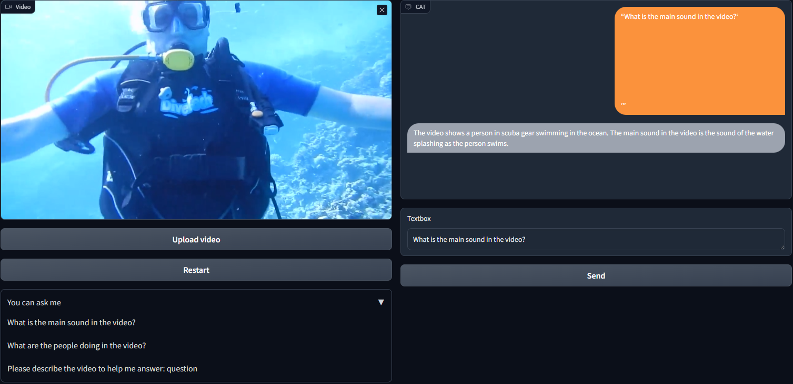
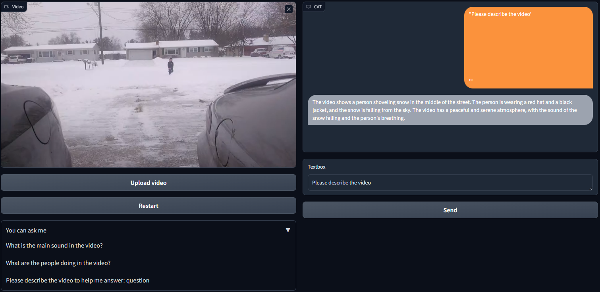
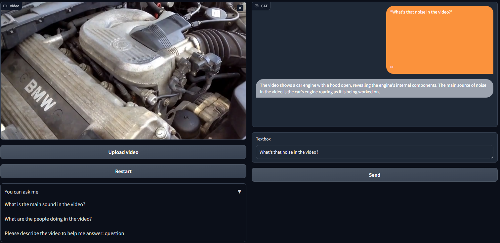

# Bay-CAT

<!-- <h1>JiuTian (九天) </h1> -->
<h2 class="papername">  CAT: Enhancing Multimodal Large Language Model to Answer Questions in Audio-Visual Scenarios </h2>

    <a href="https://scholar.google.com/citations?user=1joiJpUAAAAJ" target="_blank">Qilang Ye</a>,
    <a href="https://zitongyu.github.io/" target="_blank">Zitong Yu*</a>,
    <a href="https://rshaojimmy.github.io/" target="_blank">Rui Shao</a>,
    <a href="https://ieeexplore.ieee.org/author/37090029620" target="_blank">Xinyu Xie</a>,
    <a href="https://scholar.google.com/citations?user=kPxa2w0AAAAJ" target="_blank">Philip Torr</a>,
    <a href="https://scholar.google.com/citations?user=PDgp6OkAAAAJ" target="_blank">Xiaochun Cao</a>

Great Bay University 
Harbin Institute of Technology 
University of Oxford 
Sun Yat-sen University 
*Corresponding author

[[Paper]]() [[Project Page]](https://github.com/rikeilong/Bay-CAT)

:fire: The codes and the collected instructions <b>AVinstruct</b> will be released. Stay tuned :beers: :+1: 

 
  

## Qualitative Results

## Updates
- [03/2024] [Project page](https://github.com/rikeilong/Bay-CAT) released.

## If you find this work useful for your research, please kindly cite our paper and star our repo.

## Citation
