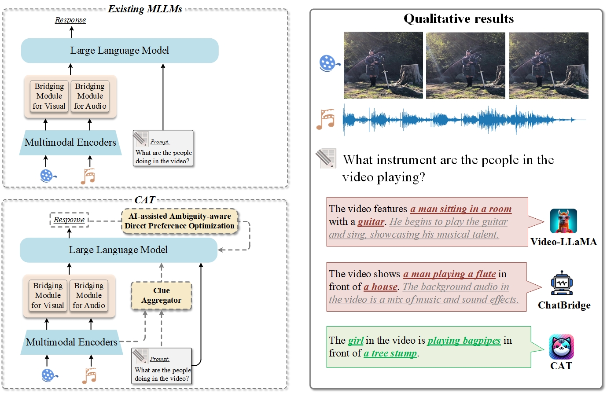

<p align="center">
  
</p>
<div align="center">
  <h3 class="papername"> 
    Enhancing Multimodal Large Language Model to Answer Questions in Dynamic Audio-Visual Scenarios </h3>
<div align="center" font size="5">
    <a href="https://scholar.google.com/citations?user=1joiJpUAAAAJ" target="_blank">Qilang Ye<sup>1</sup></a>,
    <a href="https://zitongyu.github.io/" target="_blank">Zitong Yu*<sup>1</sup></a>,
    <a href="https://rshaojimmy.github.io/" target="_blank">Rui Shao<sup>2</sup></a>,
    <a href="https://ieeexplore.ieee.org/author/37090029620" target="_blank">Xinyu Xie<sup>1</sup></a>,
    <a href="https://scholar.google.com/citations?user=kPxa2w0AAAAJ" target="_blank">Philip Torr<sup>3</sup></a>,
    <a href="https://scholar.google.com/citations?user=PDgp6OkAAAAJ" target="_blank">Xiaochun Cao<sup>4</sup></a>
</div>

<sup>1</sup> Great Bay University<br>
<sup>2</sup> Harbin Institute of Technology, Shenzhen<br>
<sup>3</sup> University of Oxford<br>
<sup>4</sup> Shenzhen Campus of Sun Yat-sen University<br>
<p>*Corresponding author</p> 

[](https://arxiv.org/abs/2403.04640)
[](https://github.com/rikeilong/Bay-CAT/blob/main/LICENSE)
</div>

## News :loudspeaker:

* **[09/2024]**  We have released code about fine-tuning and ADPO's.
* **[07/2024]**  We have released the collected AVinstruct dataset.
* **[07/2024]**  Our work has been accepted by ECCV 2024!
* **[03/2024]**  [Arxiv paper](https://arxiv.org/abs/2403.04640) released.
* **[03/2024]**  [Project page](https://github.com/rikeilong/Bay-CAT) released.


## Introduction :bulb:
<p align="left">
We introduce the CAT, enhancing MLLM in three ways:<br> 
1) We design a clue aggregator that aggregates question-related clues in dynamic audio-visual scenarios to enrich the detailed knowledge required for large language models.<br> 
2) CAT is trained on a mixed multimodal dataset, allowing direct application in audio-visual scenarios. Notably, we collect an audio-visual joint instruction dataset named AVinstruct, to further enhance the capacity of CAT to model cross-semantic correlations.<br> 
3) We propose AI-assisted ambiguity-aware direct preference optimization, a strategy specialized in retraining the model to favor the non-ambiguity response and improve the ability to localize specific audio-visual objects.
</p>

<div align="center">

</div>

## Demo 🤗
<p align="center">
  
   
</p>

<p align="center">
  
   
</p>

<p align="center">
  
   
</p>

<p align="center">
  
   
</p>

## Training & Validation
We have collect an audio-visual joint instruction dataset, named AVinstruct, details in [Data.md](AVinstruct/Data.md).

## Citation ✏️
## If you find this work useful for your research, please kindly cite our paper and star our repo.
```
@misc{ye2024cat,
      title={CAT: Enhancing Multimodal Large Language Model to Answer Questions in Dynamic Audio-Visual Scenarios}, 
      author={Qilang Ye and Zitong Yu and Rui Shao and Xinyu Xie and Philip Torr and Xiaochun Cao},
      year={2024},
      eprint={2403.04640},
      archivePrefix={arXiv},
      primaryClass={cs.CV}
}
```
